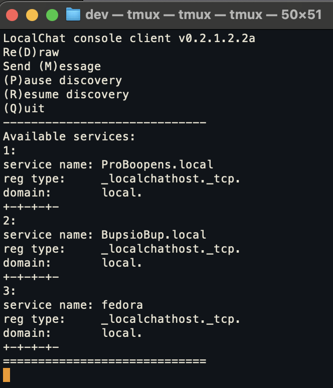
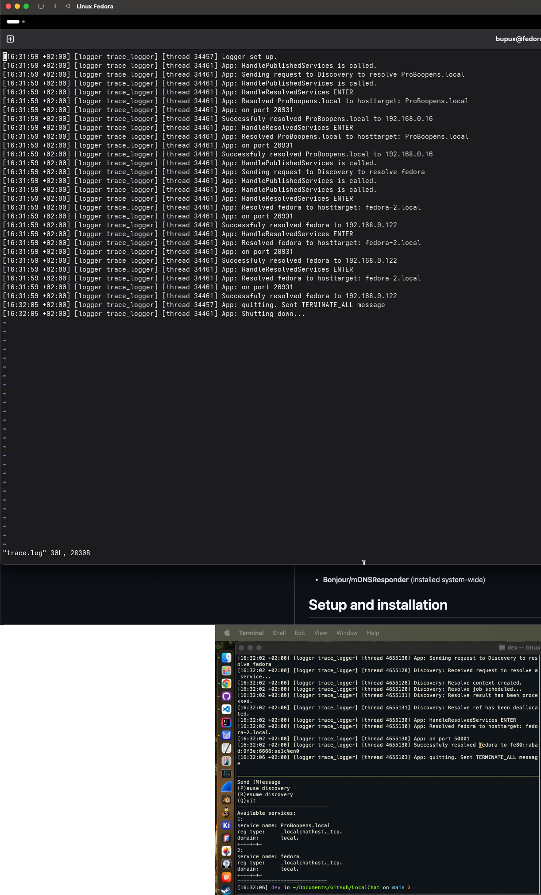

# LocalChat
LocalChat is a cross-platform application written in C++17 that allows hosts in the same network to communicate.
It uses **mDNS / DNS-SD** for service discovery, allowing machines on the same LAN to find each other automatically.

This is my engineering thesis.

For now, service browsing and service resolution in a controlled, asynchronous manner has been implemented:

Screenshot shows resolved fedora service running on virtual machine and macOS service running locally on the same machine. 

## Dependencies
### All
- **CMake**
- **Threads / concurrency primitives from the C++ standard library**
- **Boost ASIO**
- **wxWidgets**
- **spdlog**
- **Google Test**
### Linux
- **Avahi** (daemon installed system-wide, need to install avahi-devel to compile)
### macOS
- **Bonjour/mDNSResponder** (installed system-wide)

# Setup and installation
## macOS
### Bonjour
Bonjour framework, mDNSResponder and mDNSResponderHelper are installed system-wide by default on macOS.
mDNSResponder and mNDSResponderHelper daemons are run at boot.
LocalChat is tested and run on macOS Monterey 12.3.1 and macOS Sequoia.

## Linux
### Avahi
Tested on Fedora Linux Workstation 43
Install avahi-devel, cmake, boost, gcc, g++, wxGTK-devel, spdlog
avahi-daemon runs on boot, however avahi-devel is needed to compile the source.
For development see docs/linux_notes.md

## All
cmake build .
make -jX, where X is the number of threads.
./LocalChat

## Windows
**Windows is currently not supported.**